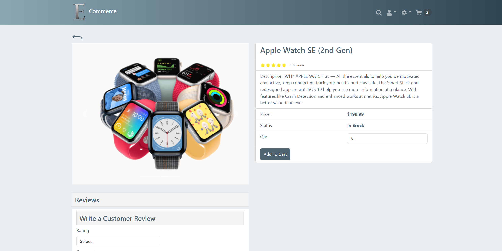
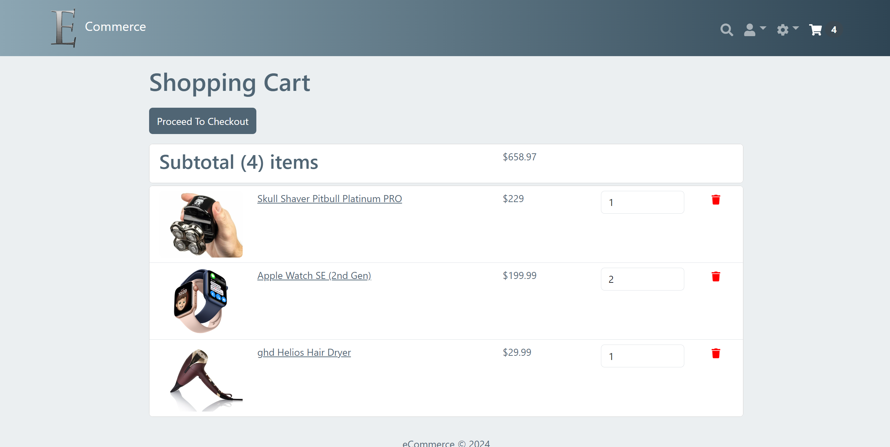
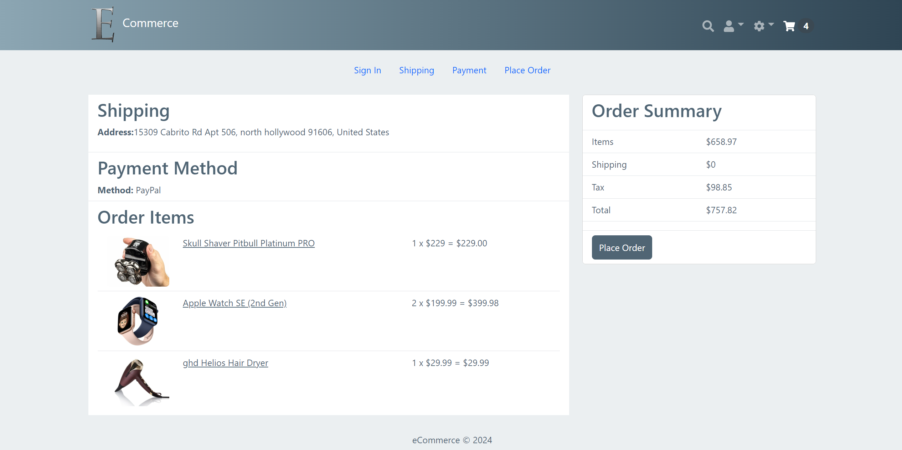
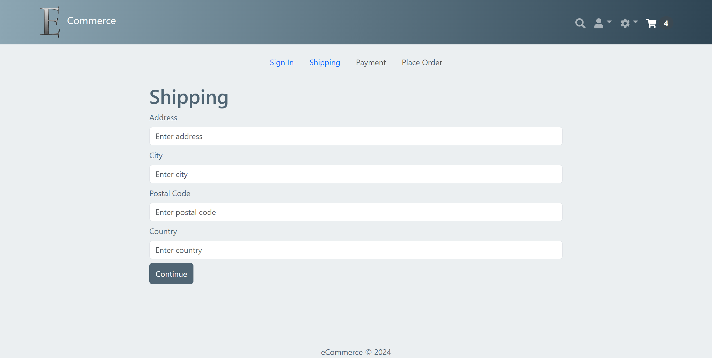
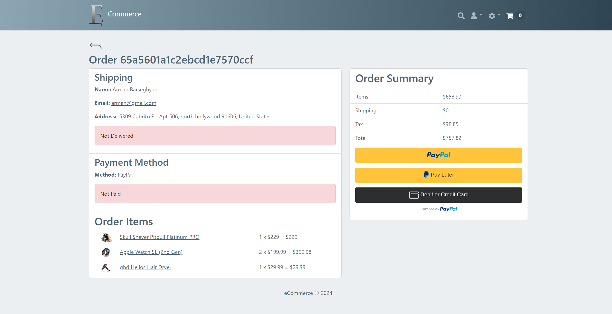
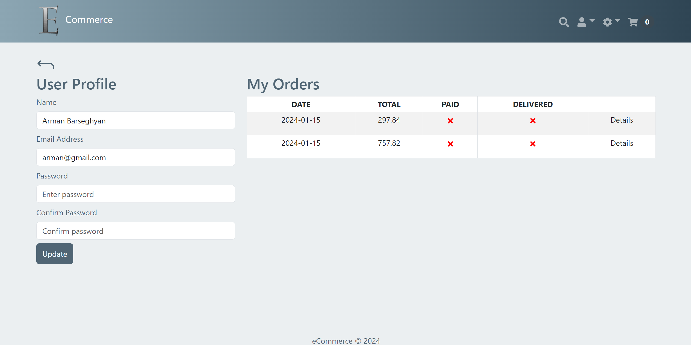
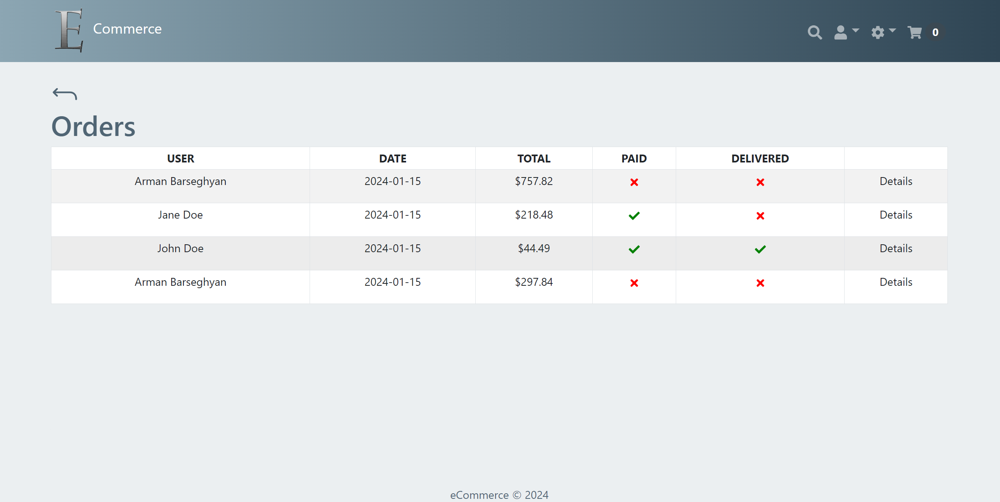
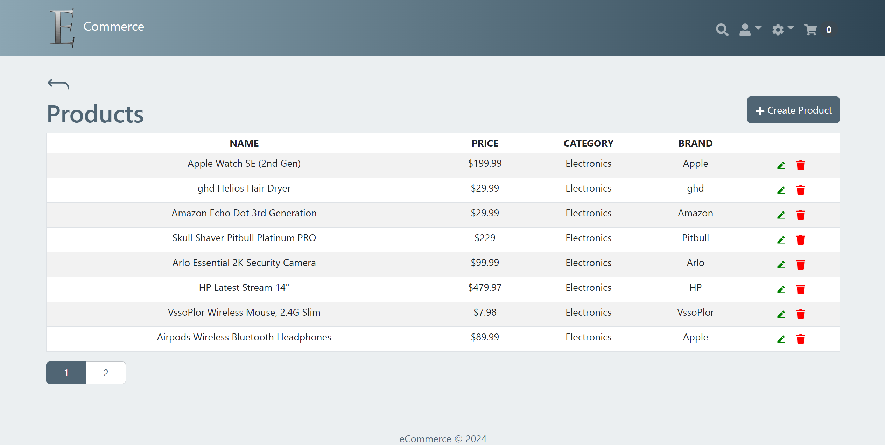
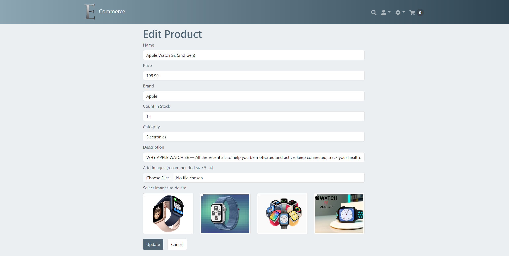

# E Commerce

## Description
This is a fully functional e-commerce website where the user can browse, add to cart, and buy products using PayPal. Admin users can create, delete, or edit products and users.

## Technologies Used
- HTML
- CSS
- React Bootstrap
- React
- MongoDB
- Express
- MERN

## Usage
Login to the users account using the login form. Register an account using the register form. Use the navbar buttons to navigate between the pages.

### Go to [E Commerce](https://ecommerce-505z.onrender.com)

## Screenshots
**Home page:**

**Product page:** 

**Cart page:**

**Place order page:**

**Shipping page:**

**Payment page:**

**Profile page:**

**Orders page (admin only):**

**Products page (admin only):**

**Edit product page (admin only):**

## Questions
### Use the links below if you have any questions.
- Email Address - [armanbarseghyan83@gmail.com](mailto:armanbarseghyan83@gmail.com)
- Linkedin - [https://www.linkedin.com/in/arman-barseghyan](https://www.linkedin.com/in/arman-barseghyan)
- GitHub Profile - [https://github.com/ArmanBarseghyan83](https://github.com/ArmanBarseghyan83)